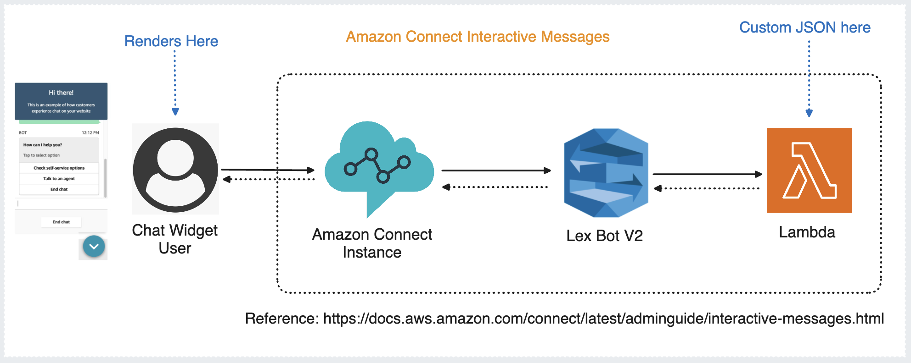
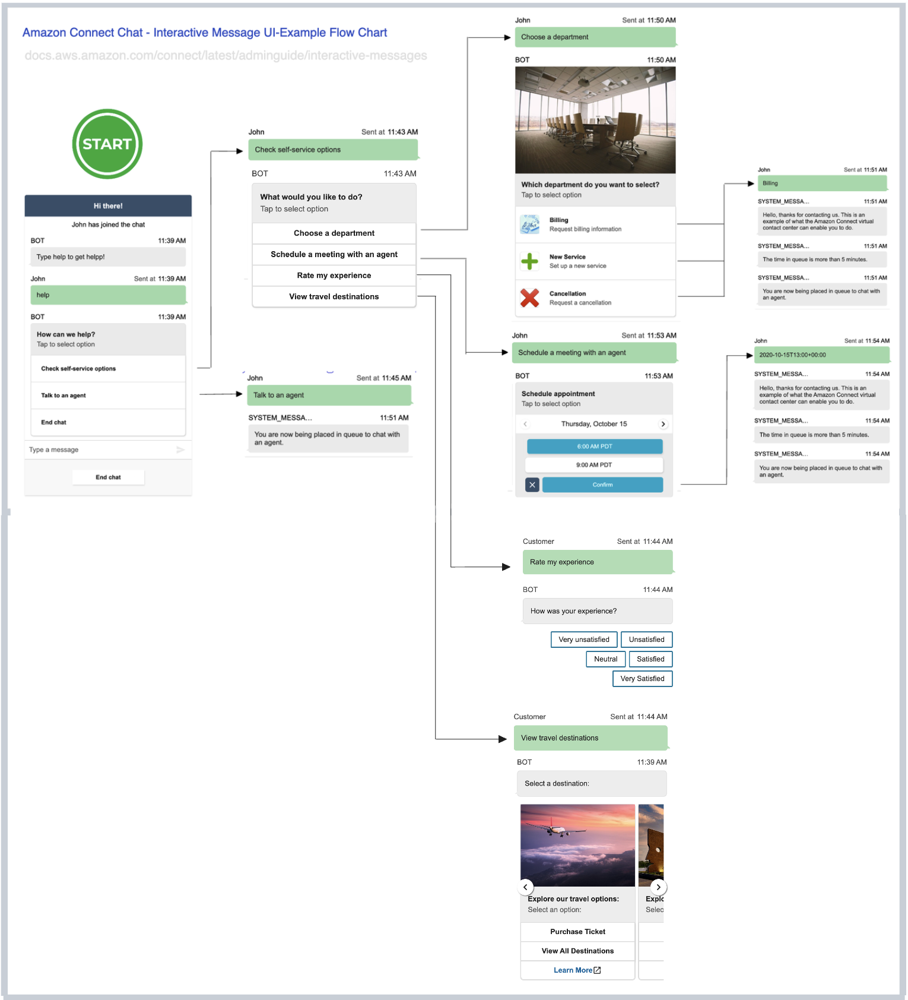

# Amazon Connect Interactive Message Chat Infra [Lex V2]

Boilerplate for Amazon Connect Chat Interactive Message feature [Lex Bot V2]

## Links

* Documentation: https://docs.aws.amazon.com/connect/latest/adminguide/interactive-messages.html

## Files

## Screenshots

### Architecture

### Flow Chart

## Specifications

- Lex Bot V2 support
- Node v18+

## Deployment

### Connect Instace

Create an Amazon Connect Instance to use, follow [documentation](https://docs.aws.amazon.com/connect/latest/adminguide/amazon-connect-instances.html) for more details.

| Region | Launch Button |
| ------ | ------------- |
| us-east-1 (N. Virginia)  |   |
| us-west-2 (Oregon)       |        |
| ap-southeast-2 (Sydney)  |   |
| ap-northeast-1 (Tokyo)   |    |
| eu-central-1 (Frankfurt) |  |
| eu-west-2 (London)       |        |
| ap-southeast-1 (Singapore) |  |
| ca-central-1 (Canada)    |     |
| ap-northeast-2 (South Korea) |  |
| af-south-1 (Cape Town)   |    |

### Lambda 

Upload the Lambda [InteractiveMessage_LambdaCodeHook_LexV2Export.zip](./amazon-connect-interactive-message-chat-infra-lex-v2.zip) file, follow the [documentation](https://docs.aws.amazon.com/lambda/latest/dg/gettingstarted-package.html#gettingstarted-package-zip) for instructions.

| Region | Launch Button |
| ------ | ------------- |
| us-east-1 (N. Virginia) |  |
| us-west-2 (Oregon) |  |
| ap-southeast-2 (Sydney) |  |
| ap-northeast-1 (Tokyo) |  |
| eu-central-1 (Frankfurt) |  |
| eu-west-2 (London) |  |
| ap-southeast-1 (Singapore) |  |
| ca-central-1 (Canada) |  |
| ap-northeast-2 (South Korea) |  |
| af-south-1 (Cape Town) |  |

### Lex Bot 

Create a bot and import the [InteractiveMessageBot_Export_v2.zip](./InteractiveMessageBot_Export_v2.zip) file, follow the [documentation](https://docs.aws.amazon.com/lexv2/latest/dg/import-console.html) for instructions.

| Region | Launch Button |
| ------ | ------------- |
| us-east-1 (N. Virginia) |  |
| us-west-2 (Oregon) |  |
| ap-southeast-2 (Sydney) |  |
| ap-northeast-1 (Tokyo) |  |
| eu-central-1 (Frankfurt) |  |
| eu-west-2 (London) |  |
| ap-southeast-1 (Singapore) |  |
| ca-central-1 (Canada) |  |
| ap-northeast-2 (South Korea) |  |
| af-south-1 (Cape Town) |  |

### Contact Flow 

Import the [InteractiveMessaging_Flow.json](InteractiveMessaging_Flow.json) file to create an inbound contact flow, follow the [documentation](https://docs.aws.amazon.com/connect/latest/adminguide/contact-flow-import-export.html) for more details
